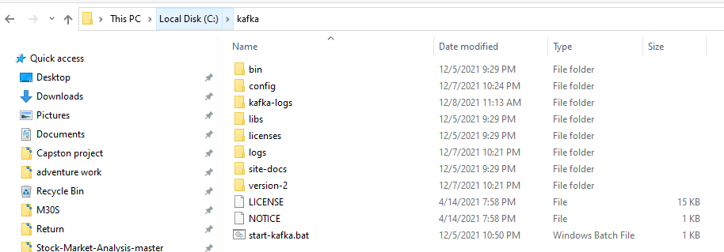
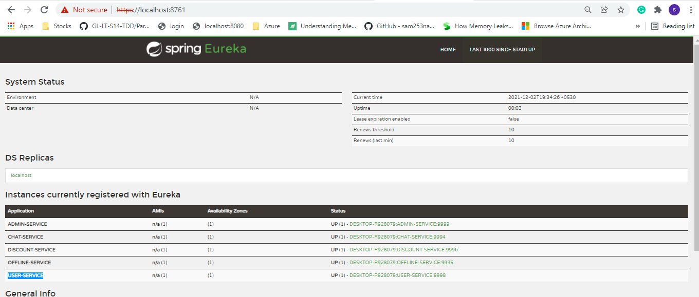
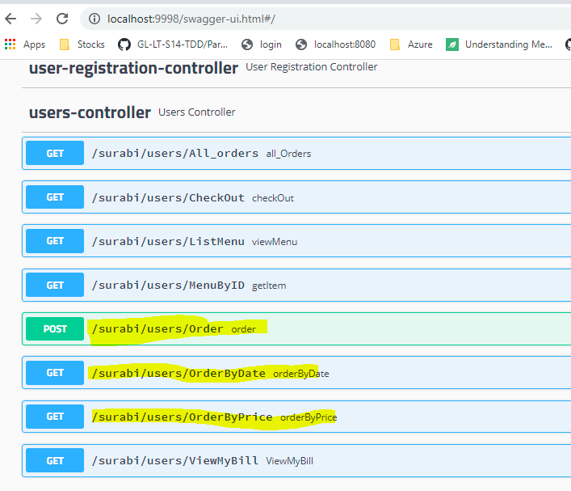
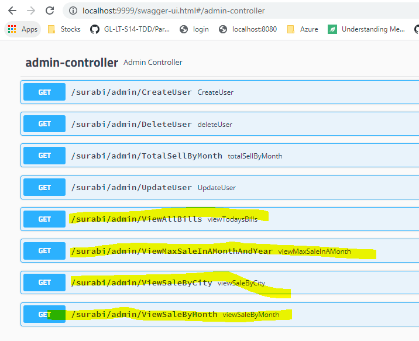
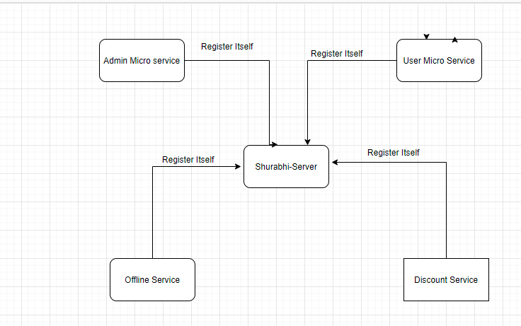
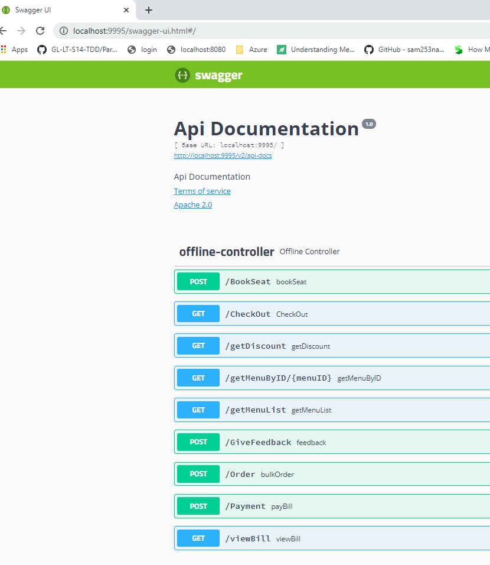

Week13:

Configure the Kafka
1. please download kafka (https://mirrors.estointernet.in/apache/kafka/2.8.0/kafka_2.13-2.8.0.tgz)
   https://kafka.apache.org/downloads
2. unzip and place under C:\kafka, example below
   Folder structure: 
   

3. Replace confi folder inside C:\kafka with folder from project config.

4. open cmd  C:\kafka and run below commands:
5.  Start Zookeeper :
   .\bin\windows\zookeeper-server-start.bat .\config\zookeeper.properties   
6. open another window and run below 
   set KAFKA_OPTS=-Djava.security.auth.login.config=C:\kafka\config\kafka_server_jaas.conf 
   
7. Start kafka server 
   .\bin\windows\kafka-server-start.bat .\config\server.properties
8. Run below commands one by one
   .\bin\windows\kafka-configs.bat --zookeeper localhost:2181 --alter --add-config SCRAM-SHA-512=[password=admin-secret] --entity-type users --entity-name admin
   .\bin\windows\kafka-configs.bat --zookeeper localhost:2181 --alter --add-config SCRAM-SHA-512=[password=secret] --entity-type users --entity-name demouser
   set KAFKA_OPTS=-Djava.security.auth.login.config=C:\kafka\config\kafka_server_jaas.conf
   .\bin\windows\kafka-acls.bat --authorizer-properties zookeeper.connect=localhost:2181 --add --allow-principal User:demouser --operation Create --operation Describe  --topic demo-topic
      ---- ignore warning
   .\bin\windows\kafka-topics.bat --create --bootstrap-server localhost:9094 --command-config .\config\ssl-user-config.properties --replication-factor 1 --partitions 1 --topic demo-topic
   .\bin\windows\kafka-acls.bat --authorizer-properties zookeeper.connect=localhost:2181 --add --allow-principal User:demouser --producer --topic demo-topic
   ---- ignore warning
   .\bin\windows\kafka-acls.bat --authorizer-properties zookeeper.connect=localhost:2181 --add --allow-principal User:demouser1 --consumer --topic demo-topic --group "*"
   ---- ignore warning

Time to run project:
1.start shurabhi-server:
2. go to https://localhost:8761/
3. download certificate
4. import Euraka using below with admin permission
   keytool -import -file "C:\Users\MS\Desktop\edu2.cer" -keystore "C:\Program Files\Java\jdk1.8.0_191\jre\lib\security\cacerts" -alias "edu2 certificate"

5. go to https://localhost:9998/swagger-ui.html#
6. download cert
7. import shurabhi-user API using below with admin permission
      keytool -import -file "C:\Users\MS\Desktop\user.cer" -keystore "C:\Program Files\Java\jdk1.8.0_191\jre\lib\security\cacerts" -alias "edu2 certificate"

8. Create a postgres DB ("shurabhi21"), script in SQL file in the root path.
9. Start all APIs (ADMIN-SERVICE, CHAT-SERVICE, DISCOUNT-SERVICE, OFFLINE-SERVICE, USER-SERVICE)
   shurabhi-server -> https://localhost:8761/
   shurabhi-discount -> https://localhost:9996/discount/getDiscount/50/GET50PER
   shurabhi-user -> https://localhost:9998/swagger-ui.html#/users-controller
   shurabhi-offline -> https://localhost:9995/swagger-ui.html#/offline-controller
   shurabhi-admin -> https://localhost:9999/swagger-ui.html#/admin-controller
   shurabhi - chat -> https://localhost:9994/swagger-ui.html#

10. In order to test massage, you can follow Week12:   

Steps used to generate certificates:
Generate all certificate using belowcommand
example for chat
keytool -genKey -alias chatkey -keystore chatkeystore -keyalg RSA

for Euraka certificate:
keytool -genKey -alias demokey -keystore demokeystore -keyalg RSA -ext "SAN:c=DNS:localhost,IP:127.0.0.1"

for shurabhi-user certificate:(as this is used by offline API)
keytool -genKey -alias shurabhiuserkey -keystore shurabhiuserkeystore -keyalg RSA -ext "SAN:c=DNS:localhost,IP:127.0.0.1"

Week12:

In order to test the chat feature:
1. Start shurabhi-server ( this is to register API to Euraka server)
2. Create a postgres DB ("shurabhi21"), script in SQL file in the root path.
3. please start zookeeper and kafak brokers (localhost:9092)
4. Create one admin user in DB, user name and password are same in this script.(INSERT INTO USERS VALUES ('ram', 'USER', TRUE, '$2a$10$CEowIBoP73DKZf./TVVLqO.Z2034Rk717xxfecnvxyt8HHVFLLe0a');)
5. start shurabhi-chat server.
6. You can register new users via chat swagger API. http://localhost:9994/swagger-ui.html#/user-registration-controller/resisterUsingPOST
7. In order to send, you need to login first (as user or admin)
8. you can send message to admin or user
9. To send message to admin, to='ADMIN' sample below
   {
   "content": "Hey Admin",
   "from": "Suresh",
   "timestamp": "string",
   "to": "ADMIN"
   }
   
10. To send msg to other user, you can specify the user name in to perimeter
11. to consume admin messages, you need to have a admin role, login with admin users to see admin messages
12. to consumer the messages of a specific user, you need to login with that user(if i want to read messages sent to Ramesh, i need to login first as Ramesh to see my messages)

Week11:
1. User and micro service updated with postgre DB, Quesries are in SQL file
2. start servers

shurabhi-server -> http://localhost:8761/
shurabhi-discount -> http://localhost:9996/discount/getDiscount/50/GET50PER
shurabhi-user -> http://localhost:9998/swagger-ui.html#/users-controller
shurabhi-offline -> http://localhost:9995/swagger-ui.html#/offline-controller
shurabhi-admin -> http://localhost:9999/swagger-ui.html#/admin-controller
In shurabhi - Offline module:(below sequence)

/Order bulkOrder -> To order in bulk
/CheckOut CheckOut -> To generate Bill
/Payment payBill -> To pay bill
other module like view bill, book seat, give feedback, view menu etc....

   

 
In shurabhi - Offline module:(below sequence)
1. /Order bulkOrder   -> To order in bulk
2. /CheckOut CheckOut -> To generate Bill
3. /Payment payBill  -> To pay bill
4. other module like view bill, book seat, give feedback, view menu etc....

